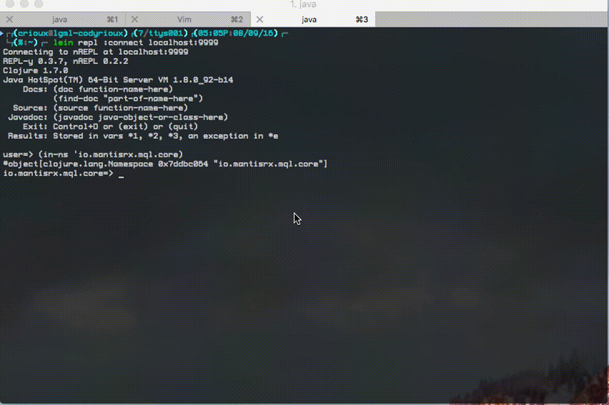

# Mantis Query Language
Mantis Query Language (MQL) is a dialect of SQL implemented as an abstraction over RxJava Observables. Our objective is to make it esay for Mantis users to query, transform, and analyze data flowing through Mantis. We achieve this objective by maintaining high fidelity to SQL syntax while adding capabilities for dealing with JSON structure, as well as a rich set of aggregates for answering analytical queries about the data in question.

We currently support the following SQL clauses:
- SELECT
  - Aggregates (Min, Max, Average, Count, Sum)
- FROM
- WHERE
- GROUP BY
- ORDER BY
- LIMIT
- WINDOW

# Contents
* [Whats New](docs/whatsnew.md)
* [Operators](docs/operators.md)
* [Sampling](docs/sampling.md)
* [Scaling Limits](docs/aggregation-scaling-limits.md)



# Getting Started
Include `io.mantisrx:mql-core:latest.release` in your build.gradle file. The current latest version is 0.0.45

There are two primary modes of operation for MQL;

* Standard Mode
* QueryManager mode

Standard mode is designed for every-day use everywhere and includes all features MQL has to offer. Typically no matter the situation the final operation executed against a stream will be a standard mode MQL query. The QueryManager mode is implemented for servers and contains a subset of functionality which enables servers to forward only relevant data to clients which are operating in standard mode. Mantis makes extensive use of this throughout the infrastructure to ensure that only the necessary data is sent over the network.

To get started using server mode please check the [QueryManager Unit Tests](src/test/java/io/mantisrx/mql/QueryManagerTest.java) or inspect any of the queryable Mantis sources for an implementation of tagging that allows the job to send only relevant data to relevant clients.

Refer to the example below for a minimalist getting started guide. If you imagine we have a source of Map<String, Object> representing your data (recall that Mantis events can be easily parsed as such) then executing a query against that Observable is only a matter of putting that observable into a Map<String, Observable> to represent the context and calling evalMql against said context. The result will
be an observable which represents the results of the query.

```java
package my.package;
import java.util.HashMap;

class MqlExample {
    public static void main(String[] args) {
        // Create a test observable source of x, y coordinates.
        Observable<HashMap<String, Object>> source = Observable.interval(100, TimeUnit.MILLISECONDS).map(x -> {
            HashMap<String, Object> d = new HashMap<>();
            d.put("x", x);
            d.put("y", x);
        });

        HashMap<String, Observable<HashMap<String, Object>> context = new HashMap<>();
        context.put("observations", source);
        // You don't have to block, and shouldn't. It is just to keep the example running.
        io.mantisrx.mql.Core.evalMql("select y from observations where x > 50 OR y == 10", context).toBlocking().forEach(System.out::println);
}

```

# Known Issues
* MQL Requires some list processing operations to allow users to fetch the first, last or index from a list object.
* Joins are not currently implemented and won't be for the time being until we've reached an acceptable level of stability and adoption with the current feature set.
* We do not currently support compile time checking of MQL query validity.

# Milestones and Timeline

The following timeline provides a rough estimate for the completion of each of the aforementioned features. In order to focus on integration with queryable sources and existing user issues we've moved joins (JOIN operator in SQL) and projection (AS operator in SQL) to a low priority.

- [x] Selection
- [x] Projection
- [x] Aggregation
- [x] Filtering (WHERE clause)
- [x] Group By
- [-] Joins
- [x] Sorting (ORDER BY clause)
- [x] Truncating (LIMIT clause)
- [x] Windowing


## Timeline

- [x] September 23rd, 2016
  - Sorting
  - Truncating
  - Windowing

- [x] September 30th, 2016
  - Projection (Moved to low priority as of September 27, 2016)
  - Group By

- [x] October 7th, 2016
  - Aggregation

- [x] October 30th, 2016
  - Extensive Integration Testing
  - Integration Into Existing Jobs
  - Documentation

# Building MQL

## JVM
```bash
./gradlew clean build
```

## NodeJS
We use an additional utility which automates much of the tedium of building NodeJS libraries (as opposed to applications) called shadow-cljs. It can be installed globally using the Node Package Manager (NPM) using `npm install -g shadow-cljs`.
```
shadow-cljs compile library
```

This build process produces an `mql.js` file in the `js` subdirectory. A `package.js` is present there which instructs NPM on how to deploy MQL. A release can be conducted by revving the version number in `js/package.js` and executing `npm publish`.
