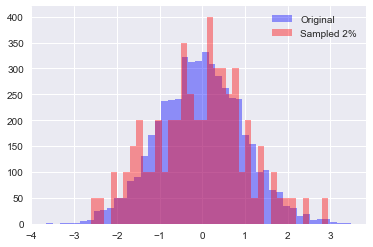

# Sampling
Sampling in MQL is an effective strategy for mitigating data volume issues.
Currently sampling comes in two flavours; Sticky and Random both of which are
documented here.

## Random Sampling
Random sampling uniformly downsamples the stream to a percentage of its original
volume. This is achieved through a sampling clause such as:

`select * from stream SAMPLE {'strategy': 'RANDOM', 'threshold': 200}`

threshold: If the generated value is < threshold it passes sampling.
factor: The hash is modded by the factor to create a number between [0, factor)
        Default 10000.

Once can therefore determine a sampling percentage by remembering that
`threshold / factor` values will be sampled -- 2% in the threshold of 200 case.

## Sticky Sampling
Sticky sampling "sticks" to certain values for the provided keys. That is if
you are sampling on ESN and you observe a specific ESN in the stream you
will observe all events which contain that specific esn. Sticky sampling
can be achieved with a query like such:

`select * from stream SAMPLE {'strategy':'STICKY','threshold':200,'keys':['esn'],'salt':1,'factor':10000}`

keys: A list of keys contained within the events to which the sampler should
      stick.
salt: A salt to add to the hash of the values.

Threshold and factor behave as they do in Random Sampling, the query above should
retrieve 2% of the total stream predicated on the events being uniformly distributed
over the ESNs.

## Accuracy

We have conducted an experiment in approximating distributional properties under
random unifrom sampling. This sampling scheme is used by MQL's random sampler.

The experiment produced a histogram of counts for devtype_id on an unsampled
stream and then compared the results against a histogram on a sampled version
of an identical stream both from StartPlayLogBlobSource. This stream provides
a very representative test of a distribution that is both jagged within the bulk
of its mass as well as with enormous tails. Accuracy results are shown in
the following table:

| Sample % | Window (Seconds) | Accuracy |
| -------: | ---------------: | -------: |
| 2%       |                1 |   ~50%   |
| 5%       |                1 |   ~65%   |
| 10%      |                1 |   ~75%   |
| 80%      |                1 |   ~96%   |
| 90%      |                1 |   ~97%   |
| 95%      |                1 |   ~98%   |
| 2%       |               10 |   ~82%   |
| 5%       |               10 |   ~88%   |
| 10%      |               10 |   ~92%   |

Users might note that increasing sampling has a non-linear relationship
with accuracy and that we can achieve 75% distributional approximation
with only 10% of the data over a one second interval. We can achieve
82% accuracy over a ten second interval with only 2% of the data.

Much of the inaccuracy in low sampling percentages is in the tail
of the distributions. These are events that occured with a very low
frequency (maybe once) and were sampled out. This is mitigated with
longer window sizes. If you're looking for heavy hitters a significant 
downsampling strategy can be very effective.

Recall that an accuracy of 100% would be perfect replication of the
source distribution. Unless you're generating financial reports it is
highly unlikely you'll require this level of accuracy. The effect can
be visualized below, we have randomly downsampled a normal distribution
to 2% and then upsampled it by multiplying counts by 25. Blue is the
original distribution and red is the reconstructed distribution from
the sample -- this is the 50% accuracy case in the table above.

